






<!-- 实验室简介 -->

  
<strong>智能博弈实验室（Intelligame Lab）</strong> 隶属于电子科技大学，专注于 <strong>人工智能</strong> 与 <strong>智能电网</strong> 的交叉研究。在 <strong><a href="https://scholar.google.com/citations?user=6I1ytegAAAAJ&hl=en">张彦如教授</a></strong> 的带领下，实验室致力于通过数据驱动的方法提升未来能源系统的效率、韧性与智能化水平。

  
The <strong>Intelligame Lab</strong> at the University of Electronic Science and Technology of China (UESTC) is dedicated to advancing research at the intersection of <strong>Artificial Intelligence</strong> and <strong>Smart Grids</strong>. Under the leadership of <strong><a href="https://scholar.google.com/citations?user=6I1ytegAAAAJ&hl=en">Dr. Yanru Zhang</a></strong>, our lab explores data-driven methodologies for improving the efficiency, resilience, and intelligence of future energy systems.

<!-- 研究方向 -->

  
实验室的主要研究方向包括：面向电力系统的机器学习、建筑能源管理、智能电网预测分析以及多模态人工智能应用。我们拥有多样化的研究团队，现有 2 名研究员（<strong><a href="https://scholar.google.com/citations?user=EGqCbB4AAAAJ&hl=zh-CN">杨涵博士</a></strong> 和 <strong><a href="https://scholar.google.com/citations?hl=zh-CN&user=TtAHFDEAAAAJ">刘旻昊博士</a></strong>）、6 名博士研究生以及 20 多名硕士研究生，广泛开展跨学科的学术与产业合作。

  
Our core research areas include machine learning for power systems, intelligent energy management, predictive analytics for smart grids, and multi-modal AI applications. With a diverse team of 2 research fellows (<strong><a href="https://scholar.google.com/citations?user=EGqCbB4AAAAJ&hl=zh-CN">Dr. Han Yang</a></strong> and <strong><a href="https://scholar.google.com/citations?hl=zh-CN&user=TtAHFDEAAAAJ">Dr. Minhao Liu</a></strong>), 6 Ph.D. students, and over 20 master’s students, we actively engage in interdisciplinary collaborations across academia and industry.

<!-- 成果贡献 -->

  
实验室成员在人工智能与能源系统领域的国际顶级会议和期刊上发表了多篇论文。我们注重将理论研究应用于现实问题，积极助力国家“双碳”战略与智能城市基础设施建设。

  
Our members have published in top international AI and energy systems conferences and journals. We strive to bridge theory and real-world applications, contributing to the national goals of carbon neutrality and intelligent urban infrastructure.

<h2>⭐️⭐️⭐️实验室长期招收人工智能、电气工程、计算机、智能电网等相关专业背景的本科、硕士和博士研究生，参与真实科研项目并发表高水平论文。联系我们: 左下角点击Email.</h2>
<h2>⭐️⭐️⭐️ We are actively recruiting graduate students with backgrounds in AI, Electrical Engineering, Computer Science or Smart Grid. Students will engage in real-world research projects and publish in top-tier venues.</h2>

# 🔥 News / 最新动态

<ul>
  <li>
    

      <strong>2025.05</strong>: 🎉🎉 我们的论文 <strong>《SocioDiff: A Socio-aware Diffusion Model for Residential Load Data Generation》</strong> 被 <em>IEEE Transactions on Smart Grid</em> 录用（🏆中科院一区期刊）！👉 <a href="https://github.com/Intelligame/SocialDiff">[dataset and code]</a> 
      <strong>2025.05</strong>: 🎉🎉 Our paper <strong>"SocioDiff: A Socio-aware Diffusion Model for Residential Load Data Generation"</strong> has been accepted by <em>IEEE Transactions on Smart Grid</em> (🏆Top Journal, CAS Tier 1)! 
    

  </li>

  <li>
    

      <strong>2025.05</strong>: 🎉🎉 我们的论文 <a href="https://ieeexplore.ieee.org/abstract/document/11011525"><strong>《Privacy-Preserving Personalized Federated Learning for Distributed Photovoltaic Disaggregation Under Statistical Heterogeneity》</strong></a> 被 <em>IEEE Transactions on Instrumentation and Measurement</em> 接收（中科院二区）！ 
      <strong>2025.05</strong>: 🎉🎉 Our paper <strong>"Privacy-Preserving Personalized Federated Learning for Distributed Photovoltaic Disaggregation Under Statistical Heterogeneity"</strong> has been accepted by <em>IEEE Transactions on Instrumentation and Measurement</em> (CAS Tier 2)!
    

  </li>

  <li>
    

      <strong>2022.04</strong>: 我们发布了一个开源项目 <a href="https://github.com/chenweilong915/awesome_energy_LLM"><strong>Awesome Energy LLM papers</strong></a>，致力于大语言模型在能源领域的应用。 
      We have released an open-source repository named <strong>Awesome Energy LLM papers</strong>, focusing on applications of LLMs in the energy domain.
    

  </li>
</ul>

# 🔍 Research / 研究方向

  
<strong>我们当前的研究主要集中在以下几个方向：</strong>

  
<strong>Our research interest currently focuses on:</strong>

<ul>
  <li>
    
<strong>智能电网中的人工智能（Artificial Intelligence for Smart Grids）</strong>：运用机器学习、深度学习与大语言模型提升现代电力系统中的负荷预测、需求响应与能源效率。

    
<strong>Artificial Intelligence for Smart Grids</strong>: Leveraging machine learning, deep learning, and large language models to improve load forecasting, demand response, and energy efficiency in modern power systems.

  </li>

  <li>
    
<strong>数据驱动的能源分析（Data-Driven Energy Analytics）</strong>：开发算法以分析大规模的住宅、工业和城市能源消费数据。

    
<strong>Data-Driven Energy Analytics</strong>: Developing algorithms to analyze large-scale energy consumption data for residential, industrial, and urban-scale applications.

  </li>

  <li>
    
<strong>智能优化与控制（Intelligent Optimization and Control）</strong>：探索强化学习和优化技术用于电网的实时调度、可再生能源集成与分布式能源管理。

    
<strong>Intelligent Optimization and Control</strong>: Exploring reinforcement learning and optimization techniques for real-time grid control, renewable energy integration, and distributed energy management.

  </li>

  <li>
    
<strong>跨学科融合应用（Cross-Disciplinary Applications）</strong>：将人工智能与社会、经济和环境数据相结合，推动公平的能源转型与智慧城市建设。

    
<strong>Cross-Disciplinary Applications</strong>: Integrating AI with social, economic, and environmental data to support equitable energy transitions and smart city development.

  </li>
</ul>

  
我们积极开展跨人工智能、电力系统与政策等领域的合作，致力于构建可靠、高效、具备社会意识的能源解决方案。

  
We are actively exploring collaborations across AI, energy systems, and policy domains, aiming to build reliable, efficient, and socially aware energy solutions.

# 📝 Publications / 部分论文

- *2025.05*: &nbsp;Weilong Chen, Xinru Liu, Xinran Zhang, Jian Shi, Han Yang, Zhu Han, and Yanru Zhang, **"[SocioDiff: A Socio-aware Diffusion Model for Residential Load Data Generation](https://github.com/Intelligame/SocialDiff)"**, *in IEEE Transactions on Smart Grid*, May. 2025. (**🏆Top Journal, CAS Tier 1**)

- *2025.05*: &nbsp;Xiaolu Chen; Chenghao Huang; Yanru Zhang; Hao Wang, **"[Privacy-Preserving Personalized Federated Learning for Distributed Photovoltaic Disaggregation Under Statistical Heterogeneity](https://ieeexplore.ieee.org/abstract/document/11011525)"**, *in IEEE Transactions on Instrumentation and Measurement*, vol. 74, pp. 1-11, 2025, Art no. 2529411. (**CAS Tier 2**)

- *2025.04*: &nbsp;Wenhao Hu, Weilong Chen, Weimin Yuan, Xiaolu Chen, Han Yang, Yanru Zhang, Zhu Han, **"[Feature Disentangling Dual-stream Network for User Bias Alleviation in Social Media Prediction](https://ieeexplore.ieee.org/abstract/document/10890121)"**, *ICASSP 2025 - 2025 IEEE International Conference on Acoustics, Speech and Signal Processing (ICASSP)*, Hyderabad, India, 2025, pp. 1-5. (CCF B)

- *2024.10*: &nbsp;Wenhao Hu, Weilong Chen, Weimin Yuan, Yan Wang, Shimin Cai, Yanru Zhang, **"[Dual-Stream Pre-Training Transformer to Enhance Multimodal Learning for Social Media Prediction](https://dl.acm.org/doi/abs/10.1145/3664647.3688998)"**, *ACM MM 2024 - Proceedings of the 32nd ACM International Conference on Multimedia*, Melbourne VIC, Australia, 2024, pp. 11450–11456. (🏆**CCF A**)

- *2024.10*: &nbsp;Yan Zhuang, Yanru Zhang, Zheng Hu, Xiaoyue Zhang, Jiawen Deng, Fuji Ren, **"[GLoMo: Global-Local Modal Fusion for Multimodal Sentiment Analysis](https://dl.acm.org/doi/abs/10.1145/3664647.3681527)"**, *ACM MM 2024 - Proceedings of the 32nd ACM International Conference on Multimedia*, Melbourne VIC, Australia, 2024, pp. 11450–11456. (🏆**CCF A**)

- *2024.10*: &nbsp;Weilong Chen, Wenhao Hu, Xiaolu Chen, Weimin Yuan, Yan Wang, Yanru Zhang, Zhu Han, **"[Tri-Modal Transformers With Mixture-of-Modality-Experts for Social Media Prediction](https://ieeexplore.ieee.org/abstract/document/10705363)"**, *in IEEE Transactions on Circuits and Systems for Video Technology*, vol. 35, no. 2, pp. 1897-1909, Feb. 2025. (**🏆Top Journal, CAS Tier 1**)

- *2024.07*: &nbsp;Chenghao Huang; Shengrong Bu; Weilong Chen; Hao Wang; Yanru Zhang, **"[Deep Reinforcement Learning-Assisted Federated Learning for Robust Short-Term Load Forecasting in Electricity Wholesale Markets](https://ieeexplore.ieee.org/abstract/document/10598399/)"**, *in IEEE Transactions on Network Science and Engineering*, vol. 11, no. 5, pp. 5073-5086, Sept.-Oct. 2024. (**CAS Tier 2**)

- *2024.06*: &nbsp;Weilong Chen, Shengrong Bu, Xinran Zhang, Yanqing Tao, Yanru Zhang, Zhu Han, **"[Semi-Supervised Federated Analytics for Heterogeneous Household Characteristics Identification](https://ieeexplore.ieee.org/abstract/document/10559406)"**, *in IEEE Transactions on Smart Grid*, vol. 15, no. 6, pp. 5799-5812, Nov. 2024. (**🏆Top Journal, CAS Tier 1**)

- *2024.06*: &nbsp;Han Yang, Weimin Yuan, Weijun Zhu, Zhenye Sun, Yanru Zhang, Yingjie Zhou, **"[Wind turbine airfoil noise prediction using dedicated airfoil database and deep learning technology](https://www.sciencedirect.com/science/article/abs/pii/S0306261924005488)"**, *in Applied Energy,*, vol.364, Art no. 123165, Jun. 2024. (**🏆Top Journal, CAS Tier 1**)

- *2024.05*: &nbsp;Weilong Chen, Shaoliang Zhang, Ruobing Xie, Feng Xia, Leyu Lin, Xinran Zhang, Yan Wang, Yanru Zhang, **"[CIPPO: Contrastive Imitation Proximal Policy Optimization for Recommendation Based on Reinforcement Learning](https://ieeexplore.ieee.org/abstract/document/10534824)"**, *in IEEE Transactions on Knowledge and Data Engineering*, vol. 36, no. 11, pp. 5753-5767, Nov. 2024. (**🏆Top Journal, CAS Tier 1**)

- *2023.10*: &nbsp; Xiaolu Chen, Weilong Chen, Chenghao Huang, Zhongjian Zhang, Lixin Duan, Yanru Zhang, **"[Double-Fine-Tuning Multi-Objective Vision-and-Language Transformer for Social Media Popularity Prediction](https://dl.acm.org/doi/abs/10.1145/3581783.3612845)"**, *ACM MM 2023 - Proceedings of the 31st ACM International Conference on Multimedia*, Ottawa ON, Canada, 2023, pp. 9462–9466. (🏆**CCF A**)

- *2022.10*: &nbsp; Weilong Chen, Chenghao Huang, Weimin Yuan, Xiaolu Chen, Wenhao Hu, Xinran Zhang, Yanru Zhang, **"[Title-and-tag contrastive vision-and-language transformer for social media popularity prediction](https://dl.acm.org/doi/abs/10.1145/3503161.3551568)"**, *ACM MM 2022 - Proceedings of the 30th ACM International Conference on Multimedia*, Lisboa, Portugal, 2022, pp. 7008–7012. (🏆**CCF A**)

- ....
- other papers can be found in [google scholar](https://scholar.google.com/citations?user=6I1ytegAAAAJ&hl=en)

# 🎖 Honors and Awards / 比赛获奖

- *2024.09*: 🏆 Best Performance Prize, ACM MM SMP 2024 International Challenge  
- *2023.09*: 🏆 Best Performance Prize, ACM MM SMP 2023 International Challenge  
- *2022.09*: 🏆 Best Performance Prize, ACM MM SMP 2022 International Challenge  
- *2020.10*: 🥈 2nd Place, NeurIPS Procgen Challenge 2020  
- *2020.09*: 🏆 Best Performance Prize, ACM MM SMP 2020 International Challenge  
- *2020.07*: 🥇 1st Place, SIGIR FinIR Challenge 2020  
- *2019 & 2020*: 🥇 1st Place, ACM WSDM Cup (consecutive years)  

# 👥 Team Members / 团队成员

### 🧑‍🏫 Director / 负责人

  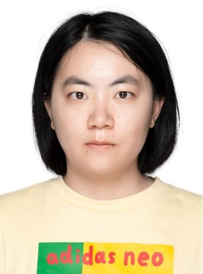
  

    <strong><a href="https://scholar.google.com/citations?user=6I1ytegAAAAJ&hl=en">张彦如 Yanru Zhang</a></strong> 
    教授 <em>Professor</em> 
    国家级人才
  

---

### 🔬 Head / 研究员

  <!-- Han Yang -->
  

    
    

      <strong><a href="https://scholar.google.com/citations?user=U0b_qQsAAAAJ&hl=zh-CN">杨涵 Han Yang</a></strong> 
      副研究员，硕士生导师 <em>Associate Research Fellow, Supervisor of Master's Students</em> 
    

  

  <!-- Minhao Liu -->
  

    
    

      <strong><a href="https://scholar.google.com/citations?hl=zh-CN&user=TtAHFDEAAAAJ">刘旻昊 Minhao Liu</a></strong> 
      副研究员，硕士生导师 <em>Associate Research Fellow, Supervisor of Master's Students</em> 
    

  

---

### 🎓 Ph.D. Students / 博士生

  

    
    

      <strong><a href="https://chenweilong915.github.io/">陈维龙 Weilong Chen</a></strong> 
      博士生 Ph.D. Student 
    

  

  <!-- Placeholder for PhD Student 2 -->
  

    
    

      <strong>王鹏 Peng Wang</strong> 
      博士生 Ph.D. Student 
    

  

  

    
    

      <strong>兰卓 Zhuo Lan</strong> 
      博士生 Ph.D. Student 
    

  

  

  
  

  <!-- Placeholder for PhD Student 2 -->
  

    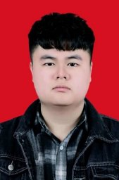
    

      <strong><a href="https://scholar.google.com.hk/citations?user=BsUa_KsAAAAJ&hl=zh-CN">谢凯 Kai Xie</a></strong> 
      博士生 Ph.D. Student 
    

  

    
    

      <strong>丘楚贤 Chuxian Qiu</strong> 
      博士生 Ph.D. Student 
    

  

  

    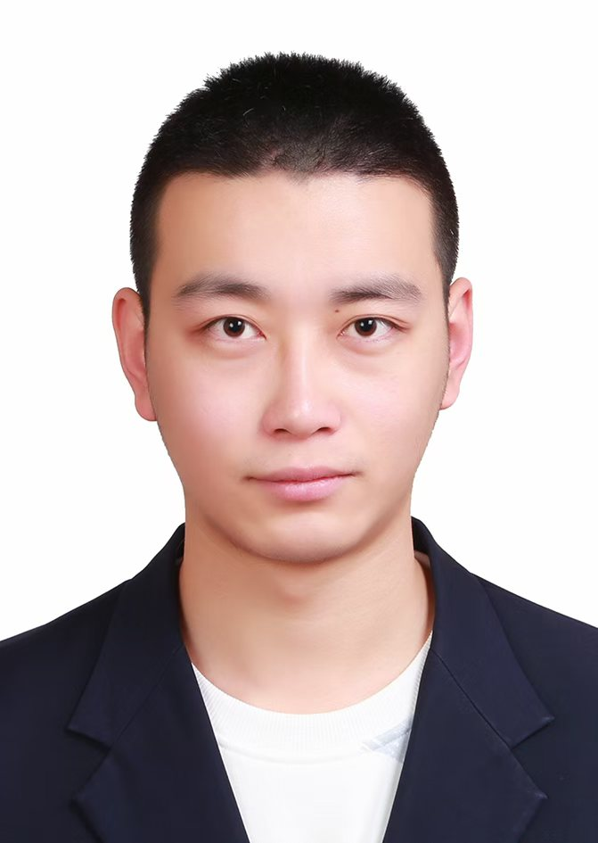
    

      <strong>陈斌 Bin Chen</strong> 
      博士生 Ph.D. Student 
    

  

---

### 🎓 Master's Students / 硕士生

  

    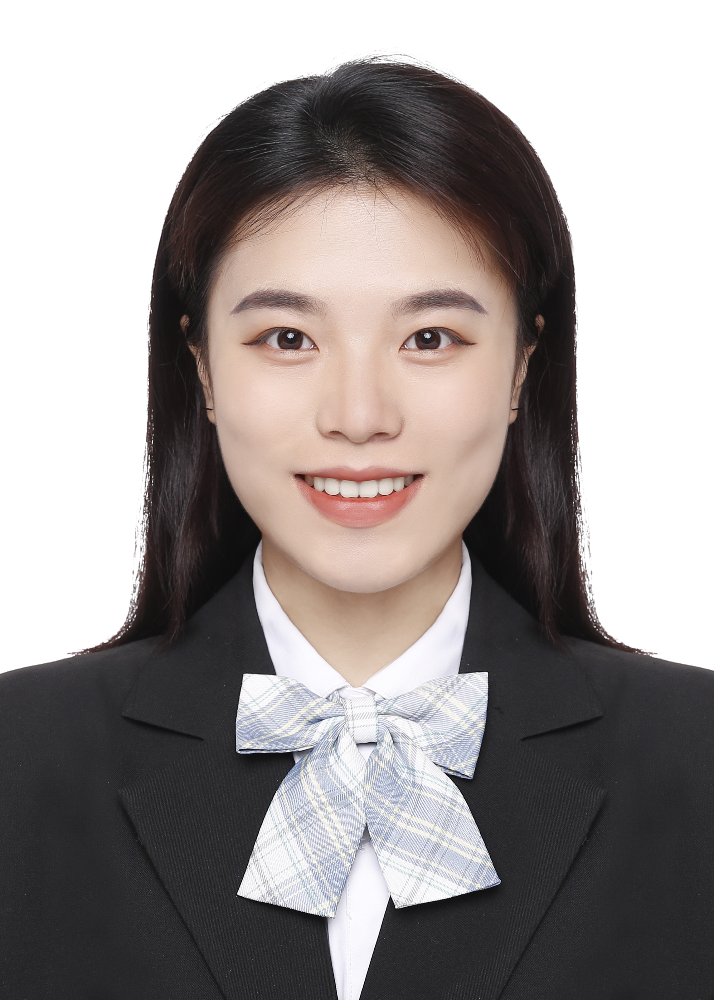
    

      <strong>刘心如 Xinru Liu</strong> 
    

  

  

    
    

    <strong>朱玲 Ling Zhu</strong> 
    

  

  

    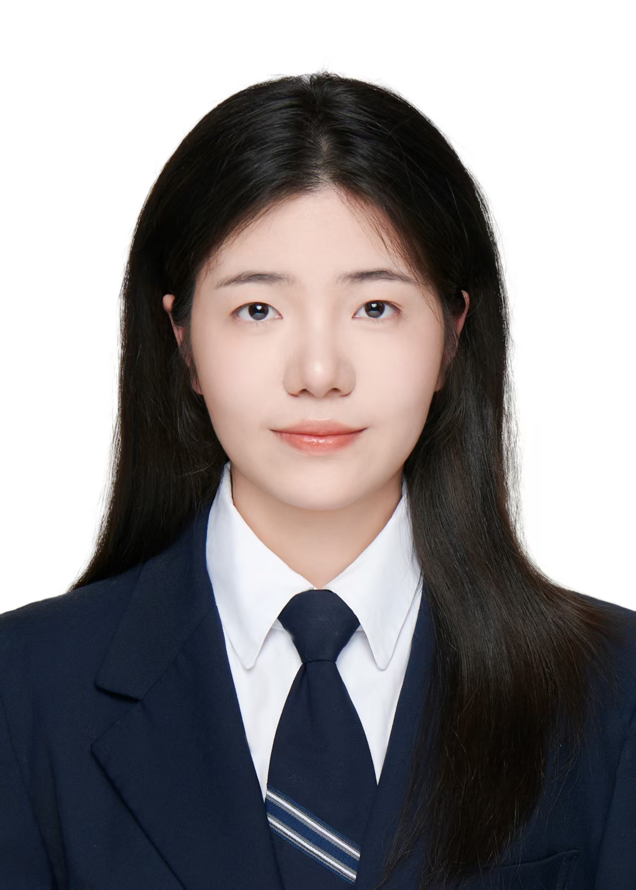
    

      <strong>胥汶渲 Wenxuan Xu</strong> 
    

  

  

    
    

      <strong>冯梦蝶 Mengdie Feng</strong> 
    

  

  

    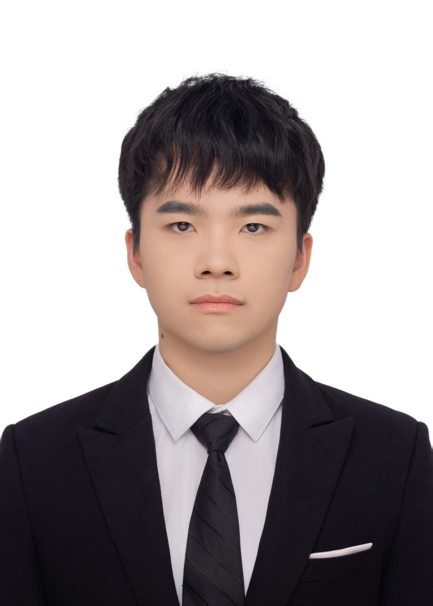
    

      <strong>蔡元卿 Yuanqin Cai</strong> 
    

  

  

    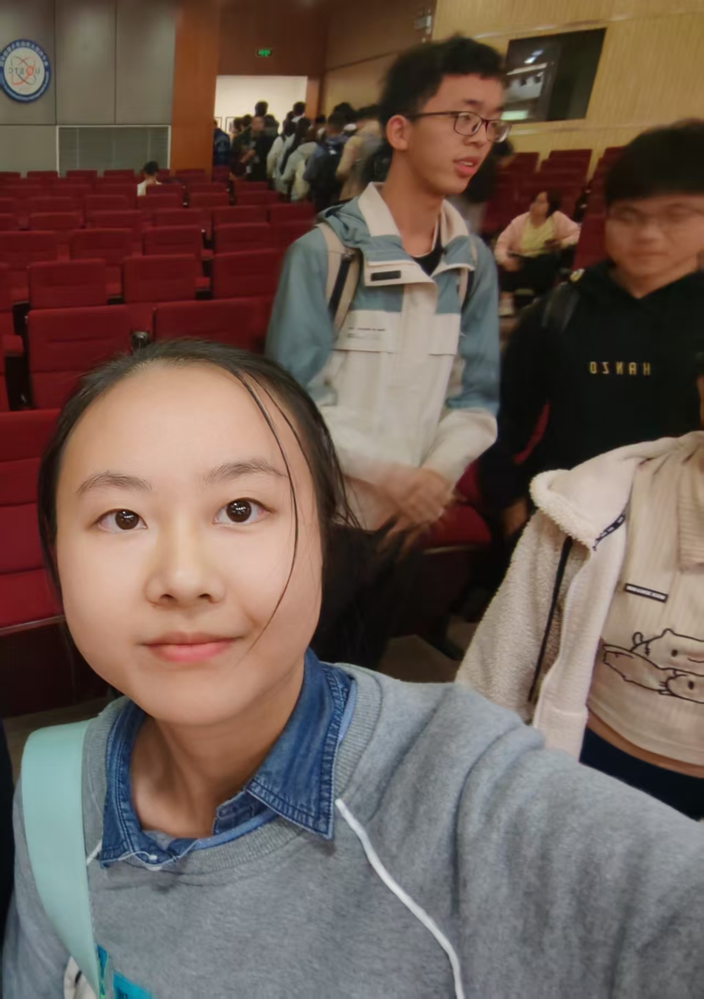
    

    <strong>梁艺馨 Yixing Liang</strong> 
    

  

  

    
    

      <strong>冯莉婷 Liting Feng</strong> 
    

  

  

  

    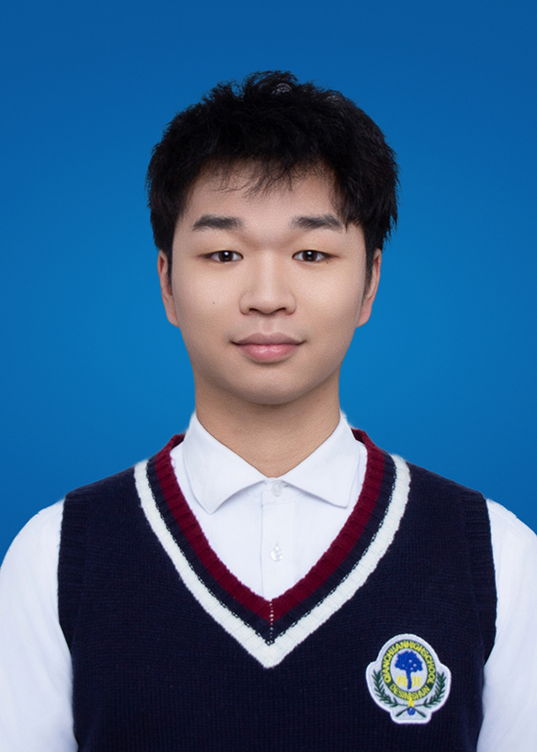
    

      <strong>李春旺 Chunwang Li</strong> 
    

  

  

    
    

      <strong>凌展旭 Zhanxu Ling</strong> 
    

  

  

    
    

      <strong>刘羽旗 Yuqi Liu</strong> 
    

  

  

    
    

    <strong>荣伟佳 Weijia Rong</strong> 
    

  

  

    
    

      <strong>王志远 Zhiyuan Wang</strong> 
    

  

  

    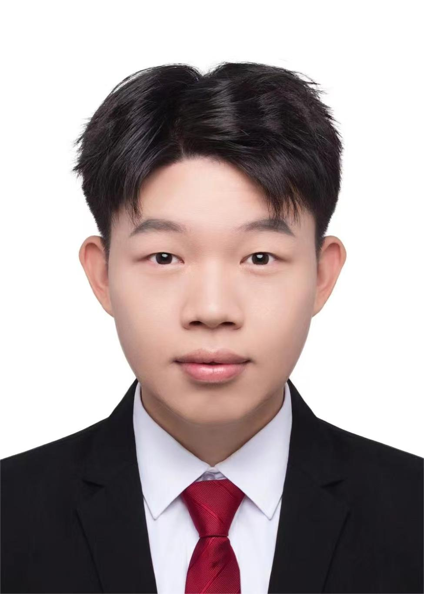
    

      <strong>周钱 Qian Zhou</strong> 
    

  

  

    
    

      <strong>李斌 Bin Li</strong> 
    

  

  

    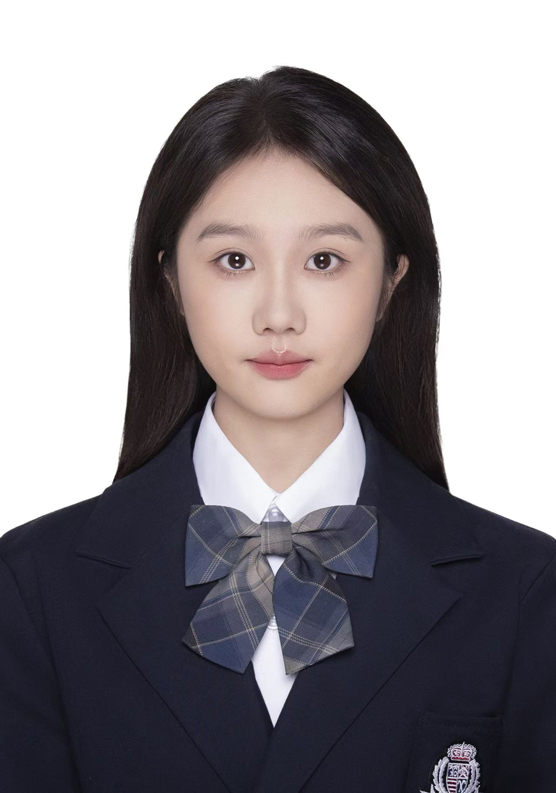
    

      <strong>覃韵怡 Yunyi Qin</strong> 
    

  

  

    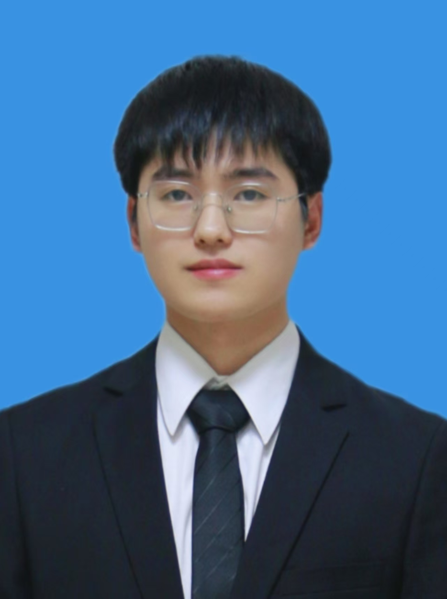
    

    <strong>赖霖喆 Linzhe Lai</strong> 
    

  

# 💻 Alumni / 毕业生

## 🎓 Academic / 学术界

  

    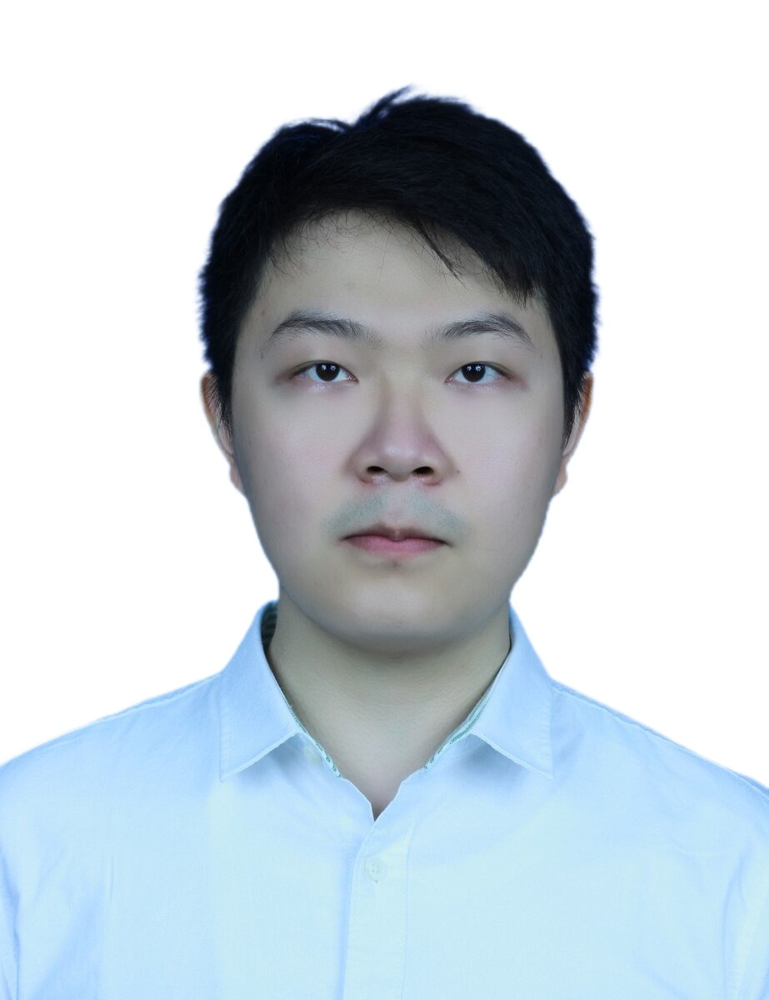
    

    <strong><a href="https://research.aalto.fi/en/persons/yu-bai">白玉 Yu Bai</a></strong> 
      2021级硕士毕业生 Graduated Master Student 
      阿尔托大学在读博士 Ph.D. student in Aalto university
    

  

  

    
    

    <strong><a href="https://scholar.google.com/citations?user=DtOl0DkAAAAJ&hl=zh-CN">庄岩 Yan Zhuang</a></strong> 
      2022级硕士毕业生 Graduated Master Student 
      电子科技大学在读博士 Ph.D. student in UESTC
    

  

  

    
    

    <strong><a href="https://scholar.google.com/citations?user=X3Pwc_sAAAAJ&hl=zh-CN">张瑞昌 Ruichang Zhang</a></strong> 
      2022级硕士毕业生 Graduated Master Student 
      英国曼彻斯特大学在读博士 Ph.D. student in University of Manchester
    

  

  

    
    

    <strong><a href="https://stephlee12.github.io/">李金豪 Jinhao Li</a></strong> 
      2022级本科毕业生 Undergraduate graduates 
      莫纳什大学在读博士 Ph.D. student in University of Manchester
    

  

  

  

    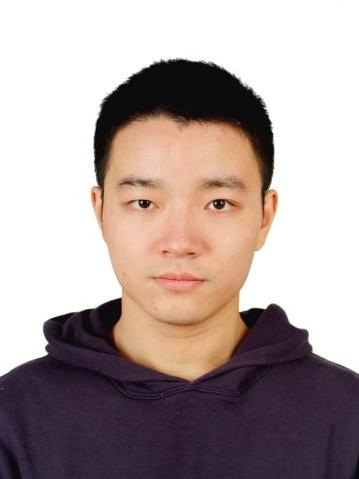
    

    <strong><a href="https://scholar.google.com.au/citations?user=eQIg4c8AAAAJ&hl=en">黄承浩 Chenghao Huang</a></strong> 
      2023级硕士毕业生 Graduated Master Student 
      莫纳什大学在读博士 Ph.D. student in Monash University
    

  

  

  

    
    

      <strong><a href="https://scholar.google.com/citations?user=KAtP2HUAAAAJ&hl=zh-CN">袁伟民 Weimin Yuan</a></strong> 
      2024级硕士毕业生 Graduated Master Student 
      休斯敦大学在读博士 Ph.D. student in University of Houston
    

  

  

    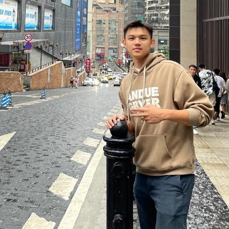
    

      <strong><a href="https://github.com/HWH-2000">胡文浩 Wenhao Hu</a></strong> 
      2025级硕士毕业生 Graduated Master Student 
      卓克索大学在读博士 Ph.D. student in Drexel University
    

  

## 🏭 Industry / 工业界

#### 🎓 2025级毕业生

- **张谢云**  
  就业单位：立晟智能科技有限公司

- **魏春晨**  
  就业单位：中国电子科技集团公司第十四研究所（中电14所）

#### 🎓 2024级毕业生

- **郭康帅**  
  就业单位：美团（Meituan）

- **陈昱汐**  
  就业单位：腾讯（Tencent）

- **张重坚**  
  就业单位：中兴（ZTE）

- **常钰**  
  就业单位：百度（Baidu）

- **杨顺吉**  
  就业单位：[信息已经被隐藏]

#### 🎓 2023级毕业生

- **何攀**  
  就业单位：上海魔珐科技公司
- **成典**  
  就业单位：TP-LINK
- **王虓一**  
  就业单位：[信息已经被隐藏]地区公务员
- **黄和金**  
  就业单位：[信息已经被隐藏]银行

#### 🎓 2022级毕业生

- **洪峰**  
  就业单位：华为（Huawei）

  

#### 🎓 2021级毕业生

- **袁鑫**  
  就业单位：成都飞机工业（集团）有限责任公司 （成飞）

- **张赛**  
  就业单位：西南电子电信技术研究所 （成都）